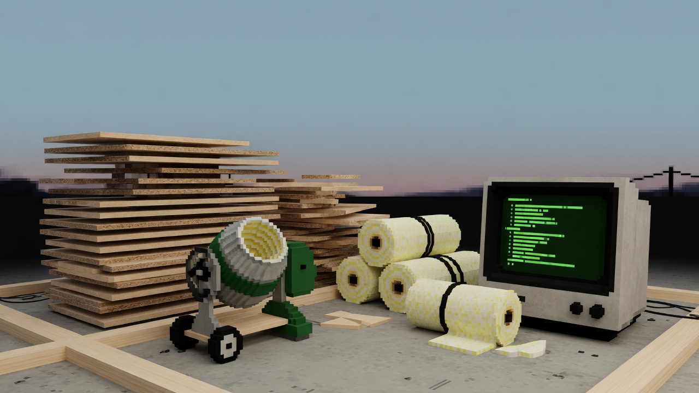
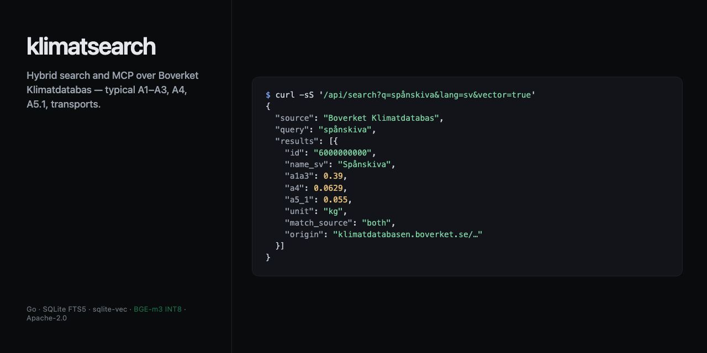

<div align="center">


[](https://github.com/mong-x/klimatsearch/actions/workflows/ci.yml)
[](https://github.com/mong-x/klimatsearch/actions/workflows/e2e-kind.yml)
[](https://go.dev)
[](./LICENSE)
[](https://modelcontextprotocol.io)
[](https://mong-x.github.io/klimatsearch/)
[](https://mong-x.github.io/klimatsearch/swagger/)

**[Site](https://mong-x.github.io/klimatsearch/)** · **[Swagger](https://mong-x.github.io/klimatsearch/swagger/)** · **[llms.txt](llms.txt)** · **[Agent playbook](docs/AGENT-SELFHOST.md)**



</div>

# klimatsearch

Go binary: hybrid search + MCP over [Boverket Klimatdatabas](https://www.boverket.se/sv/klimatdeklaration/klimatdatabas/) (~230 bilingual construction resources). Cite **Boverket Klimatdatabas**. Not affiliated with Boverket.

FTS5 BM25 → sqlite-vec KNN → RRF `k=60` → optional BGE-m3 INT8 rerank. Self-host has **no Unkey and no MPP**.

## Quick start

```bash
git clone https://github.com/mong-x/klimatsearch.git && cd klimatsearch
make run                                          # fake embedder + fixture, no network
# KLIMAT_LISTEN=:8081 make run                    # if :8080 is taken
curl -sS 'http://127.0.0.1:8080/api/search?q=betong&lang=sv'
```

Go **1.27**, **CGO**, **gcc**. Always `-tags fts5` (`make test` / `make build`). Bare `go test ./...` fails with `no such module: fts5`.

## What a hit looks like

Every search hit **is** the Resource. `a1a3` is typical GWP-GHG (Compare uses this). Conservative A1–A3, A4, A5.1, transports are extra Boverket modules — omitted on energy carriers.

```http
GET /api/search?q=spånskiva&lang=sv&vector=true
```

```json
{
  "source": "Boverket Klimatdatabas",
  "query": "spånskiva",
  "lang": "sv",
  "results": [
    {
      "id": "6000000000",
      "catalog": "boverket",
      "name_sv": "Spånskiva",
      "name_en": "Particle board",
      "description_sv": "Spånskivor är gjorda av träspån och lim…",
      "applicability_sv": "Standard spånskiva används vanligtvis som ytmaterial…",
      "synonyms": "Spånskivor, skivor",
      "a1a3": 0.39,
      "a1a3_conservative": 0.488,
      "a4": 0.0629,
      "a5_1": 0.055,
      "unit": "kg",
      "gwp_unit": "kg CO2 eq./kg",
      "waste_factor": 1.1,
      "conservative_factor": 1.25,
      "biogenic_carbon": 0.42,
      "service_life": ">50 år",
      "conversions": { "kg/m³": 700 },
      "category": "Byggskivor",
      "category_code": "10",
      "bk04_code": "01208",
      "bk04_text": "Spånskivor",
      "std_name": "EN 312:2010",
      "std_calc": "EN 15804:A1",
      "geography": "Swedish average",
      "transports": [
        {
          "name": "Närdistribution",
          "distance_km": 40,
          "type": "Lastbil",
          "fuel": "Diesel MK1, reduktionsplikt (2024)",
          "fuel_resource_id": "6000000010"
        },
        {
          "name": "Fabrik till återförsäljare/lager",
          "distance_km": 600,
          "type": "Lastbil",
          "fuel_resource_id": "6000000010"
        }
      ],
      "version": "02.07.000",
      "match_source": "both",
      "score": 0.0164,
      "details": "/api/resources/boverket:6000000000",
      "origin": "https://klimatdatabasen.boverket.se/detaljer/10/6000000000"
    }
  ]
}
```

`match_source` is `fts` \| `vector` \| `both` \| `rerank` — not the citation. `GET {details}` is klimatsearch’s copy; `GET {details}/origin` **302**s to Boverket’s sheet.

<p align="center">
  
</p>

## REST

| Method | Path |
| --- | --- |
| GET | `/healthz` `/openapi.yaml` `/docs` |
| GET | `/api/search?q=&lang=sv\|en&vector=&rerank=&databases=` |
| GET | `/api/resources?lang=&databases=` |
| GET | `/api/resources/{id}` · `/api/resources/{id}/origin` |
| GET | `/api/resources/compare?a=&b=&unit=` |
| POST | `/admin/ingest/file?catalog=` |

`vector` and `rerank` default **off**. `{id}` is `boverket:6000000000` or a bare id (**409** if ambiguous). Compare `unit` must apply to both or **400**. `databases=` filters Catalog IDs.

```bash
curl -sS 'http://127.0.0.1:8081/api/search?q=spånskiva&lang=sv&vector=true&rerank=true'
curl -sS 'http://127.0.0.1:8081/api/resources/boverket:6000000000?lang=en'
curl -sS 'http://127.0.0.1:8081/api/resources/compare?a=6000000029&b=6000000028&unit=kg'
```

## MCP

`POST`/`GET` `/mcp` (streamable). Legacy: `GET /mcp/sse`.

| Tool | Args |
| --- | --- |
| `search_climate_data` | `query`, optional `lang`, `databases` |
| `get_resource_details` | Resource id |
| `compare_resources` | `id_a`, `id_b`, optional `unit` |

```json
{ "mcpServers": { "klimatsearch": { "url": "http://127.0.0.1:8080/mcp" } } }
```

MCP reranks when the process loaded `KLIMAT_RERANKER=onnx`. Playbook: [docs/AGENT-SELFHOST.md](docs/AGENT-SELFHOST.md).

## Retrieval quality

44 labeled queries, Klimatdatabas **02.07.000**, F2LLM-ingested DB. `make eval-golden`.

**Ship: F2LLM hybrid + BGE-m3 INT8.** Only lane with 44/44 Hit@1.

| Stage | Use | Hit@1 | Hit@3 | Inversions | Miss@20 | p50 |
| --- | --- | ---: | ---: | ---: | ---: | ---: |
| FTS | Always on | 0.750 | 0.750 | 0.000 | 0.250 | 0.1 ms |
| Hybrid (F2LLM) | Default retrieval `vector=true` | 0.955 | 0.977 | 0.045 | 0.000 | 112 ms |
| + BGE fp32 | Skip | 0.955 | 1.000 | 0.045 | 0.000 | 11.1 s |
| **+ BGE-m3 INT8** | **Reranker** `KLIMAT_ONNX_QUANT=auto` | **1.000** | **1.000** | **0.000** | 0.000 | **7.3 s** |
| + zerank fp32 | Skip | 0.955 | 1.000 | 0.045 | 0.000 | 42.3 s |
| + zerank INT8 | Never | 0.568 | 0.864 | 0.273 | 0.000 | 14.9 s |

Hit@1 = labeled Resource is rank 1. Inversion = sibling above it. Miss@20 = not in the window. Snapshot: 2026-09-18, macOS CPU.

## Ingest

`(catalog_id, resource_id)`. On start and every `168h`: Boverket JSON `GetAllResources/latest/{sv,en}/json`, merge by ResourceId, Excel fallback. ContentHash covers names, climate modules, and details — upserts re-embed and POST `catalog.changed`. BR25 file ingest is not mapped yet.

## Self-host

`make build` is ungated. Production:

```bash
export KLIMAT_EMBEDDER=onnx KLIMAT_RERANKER=onnx KLIMAT_ONNX_QUANT=auto
./bin/klimatsearch --listen=:8080
```

| Piece | Model | Notes |
| --- | --- | --- |
| Embedder | [F2LLM-v2-80M](https://huggingface.co/codefuse-ai/F2LLM-v2-80M) 320-d | last-token L2; query Instruct prefix |
| Reranker | [BGE-m3 INT8](https://huggingface.co/BAAI/bge-reranker-v2-m3) | `rerank=true` on REST |
| Skip | zerank INT8; zerank-2 | |

```bash
brew install onnxruntime && ./scripts/fetch-libtokenizers.sh && make models
python scripts/export-f2llm-onnx.py && python scripts/export-bge-reranker-onnx.py
python scripts/quantize-onnx.py models/f2llm-v2-80m
python scripts/quantize-onnx.py models/bge-reranker-v2-m3
docker compose -f deploy/compose.onnx.yml up --build    # 4 GiB, reranker on
```

Weights gitignored. Layout: [docs/SELFHOST.md](docs/SELFHOST.md). HPA: replica-local SQLite, [hpa.onnx.yaml](deploy/k8s/hpa.onnx.yaml). Hosted lane (`make build-hosted`) is Unkey + MPP — [LAUNCH.md](docs/LAUNCH.md).

## Config

Flags > env > `.env` > defaults.

| Flag / env | Default |
| --- | --- |
| `--listen` / `KLIMAT_LISTEN` | `:8080` |
| `--db` / `KLIMAT_DB` | `./data/klimat.db` |
| `--embedder` / `KLIMAT_EMBEDDER` | `auto` (`fake` \| `onnx`) |
| `--reranker` / `KLIMAT_RERANKER` | `none` |
| `--onnx-quant` / `KLIMAT_ONNX_QUANT` | `auto` → `model.int8.onnx` |
| `--ingest-interval` | `168h` (`0` off) |
| `KLIMAT_WEBHOOK_URL` | empty |

## Docs

[docs/README.md](docs/README.md) · [SELFHOST](docs/SELFHOST.md) · [AGENT-SELFHOST](docs/AGENT-SELFHOST.md) · [LAUNCH](docs/LAUNCH.md) · [CONTEXT](CONTEXT.md) · [Swagger](https://mong-x.github.io/klimatsearch/swagger/)

[Apache-2.0](./LICENSE). Cite **Boverket Klimatdatabas**.
